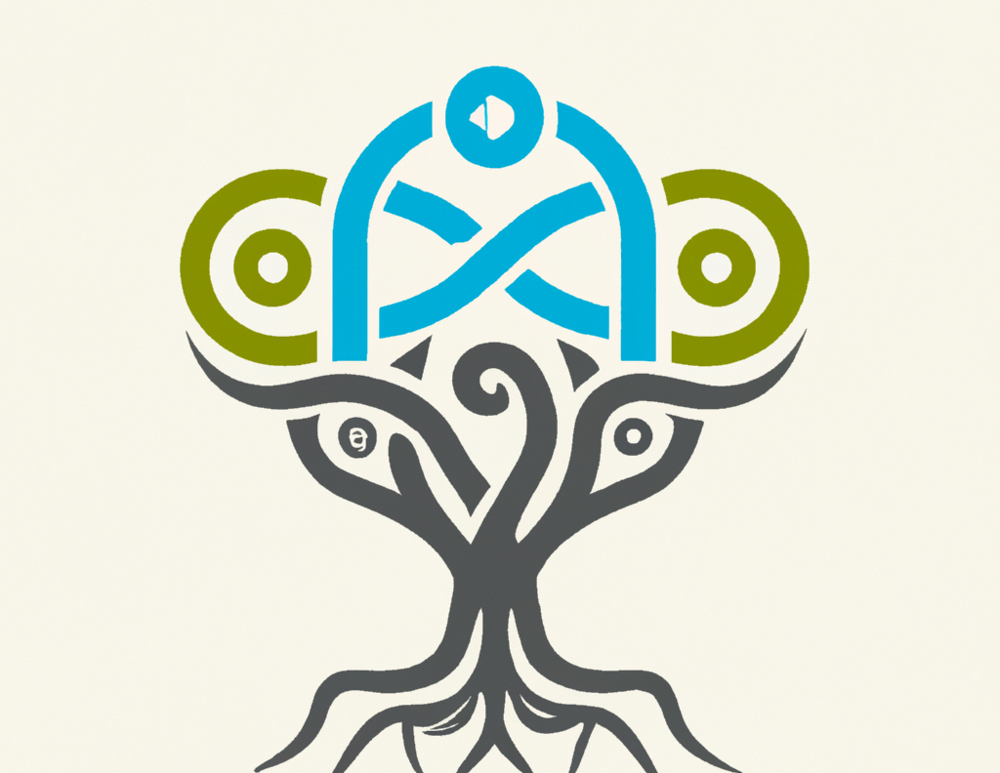

# Yggdrasil

### one pipeline to rule them all

## Objective summary

### Initialization

* Yggdrasil is a workflow written in nextflow using DSL 2
* It is initiated on LSENS once cron detects a ctg.sync.done file under a raw data directory in ../uploads
* cron will only pass the path to the raw data to Yggdrasil, everything else happens in Yggdrasil

### General Steps of the workflow

1. The CTG_samplesheet...csv is parsed looking for project ids and the raw data is symlinked into project specific directories
2. A list of project IDs is passed onto a parsing process that creates a metadata file and a samplesheet file for each project
3. The raw data and project specific samplesheet is passed into nf-cores demultiplex pipeline
4. Using the project metadata the samplesheet is passed into the correct downstream pipeline

# nextflow config strategy

In this case there is an illumina samplesheet that is supplied with every project and 
the lab doesn't touch this but instead fills in a nextflow config file.

The nextflow config file will have to contain information on all the projects that are included
in a runfolder, and paths to their respective samplesheets.

Ontologically this would be an important distinction as we now no longer have to speak of
nf core samplesheet, illumina samplesheet and ctg samplesheet. The nf-core samplesheet is generated 
and consumed within the workflow itself, while the samplesheet is the ingoing illumina samplesheet that
a customer fills in. All our parameters are now referred to as being in the configuration file, meaning
the per run folder specific nf configuration.

UPDATE on controlling inputs
If I don't want to mess with groovy too much I can generate files that carry information in the nextflow 'black box'
directory. The input of any pipeline is either CLI arguments, or that and also configuration files. 

Initially I focussed too much on creating structure *before* processing happens
inside nextflow I can create project based structure, and save where to put my final
output for the end of the workflow.

Writing the workflow for one project at a time would mean
adding complexity when we are trying to figure out which
symlinked raw data to parse. It does make more sense to 
generate the demux samplesheet in python and also to make
nextflow process a bunch of projects to directories and then
publish them to different output directories that may exist.

One question that arises will be when is a project considered done?
We need a way to control when delivery happens.

The stub functionality may be a good way to write tests
for pipelines but is labelled experimental.

Adding an official Illumina v2 Template csv file to the repo.

So... Are we tracking info on lanes?
The answer is --- maybe
If this info is available it is in the Data section.
I think the most reasonable way forward right now may be to just
use the illumina v2 samplesheet.

The way data is logged and absorbed in the lab right now
means it is too heterogenous to deal with. Input needs to be
formalized on the customer level and in the interface
between BNF and Lab. Lacking a LIMS and being constrained
with resources and time it would make most sense to expect
the Lab to deal with the information from customers and
pass along an Illumina samplesheet to bioinformaticians.

A webapp to fill out the necessary values in the samplesheet
already exists and can be deployed with some edits.
